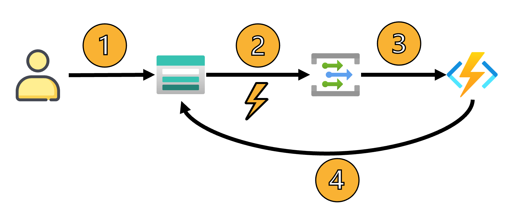

# Manage Azure Storage with Azure Functions

This repository contains examples of managing a storage account using a reactive approach using Event Grid and Azure Functions

## Restore a deleted Blob

The Azure Function called BlobDeletedFunction ([link](ServerlessBlobManager.Functions/BlobDeletedFunction.cs)) implements the following scenario:

1. The user deletes a blob
2. The Storage Account throws the `Microsoft.Storage.BlobDeleted` event
3. Event Grid routes the event to the Azure Functions
4. Azure Functions, using Storage Account SDK, restores the blob

