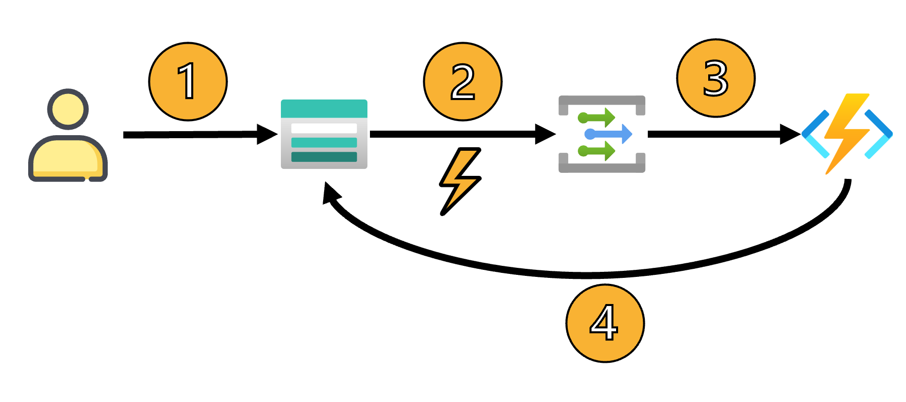

# Manage Azure Storage with Azure Functions

## Description

This repository contains examples of managing a storage account using a reactive approach using Event Grid and Azure Functions.

## AZD Process

### Requirements

Before deploying this project with Azure Developer CLI (AZD), ensure you have:
- Azure Developer CLI (azd) installed
- Azure CLI installed
- An active Azure subscription
- Appropriate permissions to create resources in your Azure subscription
- .NET 8.0 or later installed (for local development)

### How to Deploy with AZD

1. Initialize the AZD environment:
   ```bash
   azd up
   ```
   This command will guide you through the deployment process and create all necessary Azure resources.

2. Follow the prompts to:
   - Select your Azure subscription
   - Choose a deployment region
   - Provide any required environment variables

3. The deployment will automatically provision:
   - Azure Storage Account
   - Azure Function App
   - Event Grid subscription
   - Required role assignments and managed identities

### How to Remove

To clean up all Azure resources created by this deployment:

```bash
azd down
```

This command will remove all resources associated with this AZD environment.

## Features

### Restore a deleted Blob

The Azure Function called BlobDeletedFunction ([link](ServerlessBlobManager.Functions/BlobDeletedFunction.cs)) implements the following scenario:



1. The user deletes a blob
2. The Storage Account throws the `Microsoft.Storage.BlobDeleted` event
3. Event Grid routes the event to the Azure Functions
4. Azure Functions, using Storage Account SDK, restores the blob


