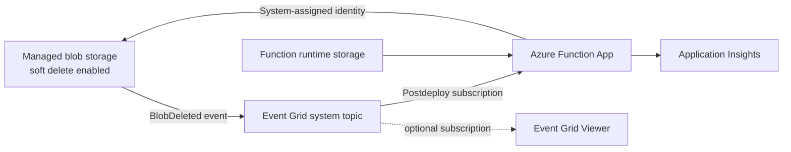

# Serverless Blob Manager - IaC

Bicep templates used by the [Azure Developer CLI](https://aka.ms/azd) to provision the environment that hosts the Serverless Blob Manager project.

## Architecture



The deployment creates one resource group per AZD environment. Resource names are generated from the environment, subscription, and location so that they are stable and globally unique where required.

## Resources

| Resource | Purpose |
| --- | --- |
| Managed storage account | Stores the blobs managed by the application and enables blob soft delete. |
| Function App and Consumption plan | Hosts the .NET isolated worker that restores deleted blobs. |
| Function runtime storage account | Provides storage required by the Azure Functions host. |
| Application Insights | Collects Function App telemetry. |
| Event Grid system topic | Publishes events from the managed storage account. |
| Role assignment | Grants the Function App identity **Storage Blob Data Contributor** on the managed storage account. |
| Event Grid Viewer | Optionally displays events routed from the system topic. |

## Layout

```text
infra/
|-- main.bicep                          # subscription-scope orchestration entry point
|-- main.parameters.json                # maps AZD environment values to Bicep parameters
|-- abbreviations.json                  # CAF resource type prefixes used to build resource names
|-- modules/
    |-- storage.bicep                   # the storage account to manage (soft delete enabled)
    |-- functionApp.bicep               # function app, plan, runtime storage, Application Insights
    |-- storageRoleAssignment.bicep     # blob data access on the managed storage account
    |-- eventGrid.bicep                 # system topic on the managed storage account
    |-- eventGridViewer.bicep           # optional Event Grid Viewer web app and subscription
```

The subscription that routes `Microsoft.Storage.BlobDeleted` events to the function is created by the azd `postdeploy` hook in `scripts/azd`, because Event Grid requires the target function to already exist.

## Prerequisites

- An Azure subscription and permission to create subscription-scope deployments, resource groups, role assignments, and the resources listed above
- [Azure Developer CLI](https://learn.microsoft.com/azure/developer/azure-developer-cli/install-azd)
- Azure CLI with the Bicep tooling when validating or deploying the template directly
- A region that supports Azure Functions, Event Grid, and the selected resources

## Deploy with azd

```bash
azd auth login
azd env new <environment-name>
azd up
```

`azd up` provisions the infrastructure and deploys the `func` service declared in `azure.yaml`.

### Optional settings

| Variable | Default | Description |
| --- | --- | --- |
| `DEPLOY_EVENT_GRID_VIEWER` | `true` | Deploys the Event Grid Viewer web app. |

Set them with `azd env set <name> <value>`. Provisioning outputs (function app name, managed storage account, Event Grid Viewer URL) are written to the AZD environment and can be read with `azd env get-values`.

`AZURE_LOCATION`, `AZURE_ENV_NAME`, and `AZURE_PRINCIPAL_ID` are supplied by AZD through `main.parameters.json`. When the principal ID is available, the template also grants the current developer **Storage Blob Data Contributor** for local debugging.

> `azd provision` alone does not create the BlobDeleted subscription. Use `azd up` (or `azd deploy`) so the postdeploy hook runs after the function code is published.

### Verify the deployment

```bash
azd env get-values
azd show
```

The environment values include the resource group, Function App, managed storage account, Event Grid topic, and optional viewer URL. Delete a test blob from the provisioned container and verify that the function restores it.

### Remove the environment

```bash
azd down --purge
```

Review the selected subscription and environment before confirming because this deletes the provisioned resource group and its resources.

## Deploy with the Azure CLI

```bash
az deployment sub create --location <region> --template-file main.bicep --parameters environmentName=<name> location=<region>
```

where

- `environmentName` is the name used to build the resource names and tags
- `location` is the region where you want to deploy

Direct Bicep deployment provisions the resources only. It does not publish the Function project or run the AZD postdeploy hook that creates the Event Grid subscription.

## Validate the Bicep templates

From the repository root:

```bash
az bicep build --file infra/main.bicep
```

For a subscription-scope preflight check without changing resources:

```bash
az deployment sub validate --location <region> --template-file infra/main.bicep --parameters environmentName=<name> location=<region>
```
