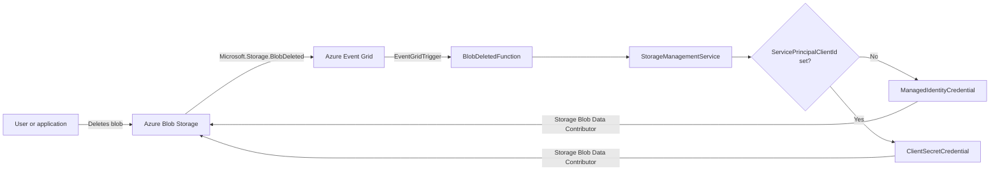

# Serverless Blob Manager source

The solution contains a .NET 8 isolated-worker Azure Function that receives `Microsoft.Storage.BlobDeleted` events from Event Grid and restores the deleted blob with the Azure Storage SDK.

## Project architecture



`BlobDeletedFunction` deserializes the Event Grid payload and delegates restoration to `StorageManagementService`. The service selects the authentication method from the Function App settings.

## Authentication configuration

The selected identity must have the **Storage Blob Data Contributor** role on the storage account that contains the deleted blobs. Blob soft delete must also be enabled on that account.

### Managed identity

Use managed identity for the deployed Function App:

1. Enable its system-assigned managed identity.
2. Assign that identity the **Storage Blob Data Contributor** role on the managed storage account.
3. Leave these Function App settings empty:

```text
ServicePrincipalClientId=
ServicePrincipalClientSecret=
ServicePrincipalTenantId=
```

The AZD Bicep deployment performs these steps automatically. With an empty client ID, the service creates a `ManagedIdentityCredential`. This credential requires an Azure managed identity endpoint and therefore is not available when the function runs directly on a developer workstation.

### Service principal

Use a service principal when running locally or when managed identity is not available:

1. Create a Microsoft Entra application and service principal.
2. Assign it the **Storage Blob Data Contributor** role on the managed storage account.
3. Set the following values in `ServerlessBlobManager.Functions/local.settings.json`:

```json
{
  "IsEncrypted": false,
  "Values": {
    "AzureWebJobsStorage": "UseDevelopmentStorage=true",
    "FUNCTIONS_WORKER_RUNTIME": "dotnet-isolated",
    "ServicePrincipalClientId": "<application-client-id>",
    "ServicePrincipalClientSecret": "<client-secret>",
    "ServicePrincipalTenantId": "<tenant-id>"
  }
}
```

Do not commit secrets. For an Azure-hosted Function App, store the secret in Azure Key Vault and use a Key Vault reference in the app setting.

## Test the function locally

### Prerequisites

- .NET 8 SDK
- Azure Functions Core Tools v4
- Azurite for the Functions host runtime storage
- An Azure storage account with blob soft delete enabled
- A service principal configured as described above

Azurite supplies `AzureWebJobsStorage`, but the restore operation must target an Azure storage account that supports blob soft delete.

### Run an end-to-end test

1. Start Azurite.
1. Add the service-principal values to `ServerlessBlobManager.Functions/local.settings.json`.
1. In the Azure storage account, upload a test blob and then delete it.
1. Replace the `data.url` value in `ServerlessBlobManager.Functions/Entities/BlobDeletedEventPayload.json` with the deleted blob URL.
1. Start the Function host:

```powershell
Set-Location ServerlessBlobManager.Functions
func start
```

1. From a second PowerShell terminal in the `src` directory, send the sample Event Grid event:

```powershell
$event = Get-Content ./ServerlessBlobManager.Functions/Entities/BlobDeletedEventPayload.json -Raw | ConvertFrom-Json
$body = ConvertTo-Json -InputObject @($event) -Depth 10
Invoke-RestMethod `
  -Method Post `
  -Uri "http://localhost:7071/runtime/webhooks/EventGrid?functionName=BlobDeletedFunction" `
  -Headers @{ "aeg-event-type" = "Notification" } `
  -ContentType "application/json" `
  -Body $body
```

1. Confirm that the host logs report a successful `UndeleteBlobAsync` result and that the blob is restored in its container.
